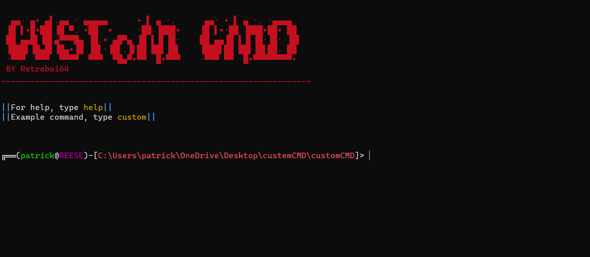

# Warning This is in BETA v0.2

Click the image above to watch the video on YouTube.

# customCMD - Custom Command Prompt

customCMD is a customizable command prompt script with a retro-style ASCII art banner. It allows you to define and run custom commands, toggle settings, and execute Python scripts. This README provides instructions on how to use and customize the code to fit your needs.

## Getting Started

These instructions will help you set up and customize customCMD.

### Prerequisites

You will need:

- Python 3.x installed on your system.

### Installation

1. Clone the customCMD repository to your local machine.
2. pip install colorama or just run bat file

### Version

Warning this is in BETA 0.1v
